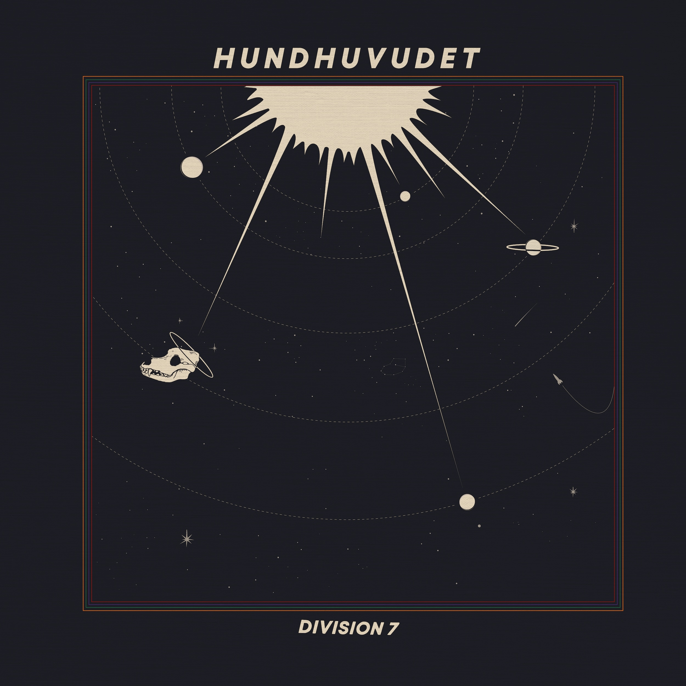
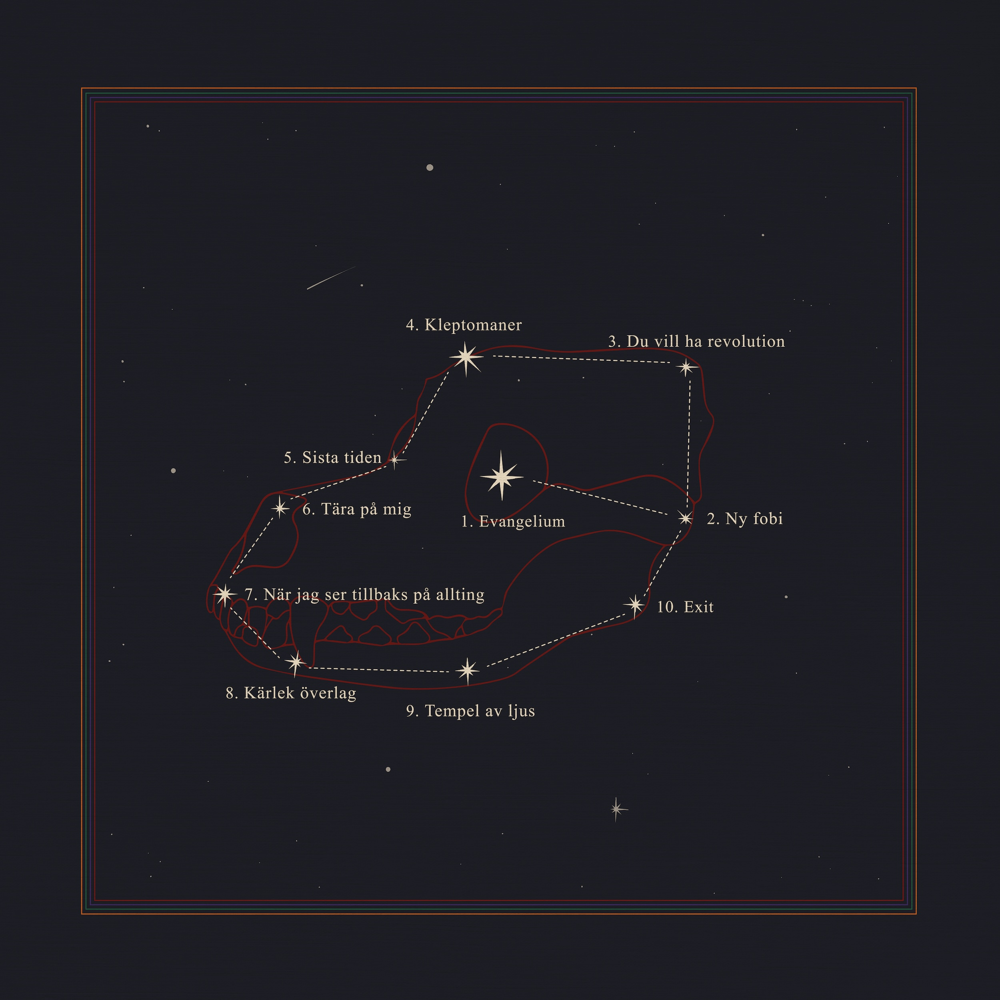

    

        
    

    

        
    


[Beställ skivan på vinyl via Septembernatt](https://www.septembernatt.se/product-page/hundhuvudet-vinyl-division-7)


Hundhuvudet handlar om att komma till insikt om behovet av personlig förändring för att hålla relationer vid liv – och lika mycket om oförmågan att åstadkomma detta. Det är det fula behovet av att sväva iväg och förälska sig i en förljugen och romantiserad självbild, för att därefter hastigt och olustigt falla tillbaka i det föraktfulla grimaserandet framför den egna spegelbilden. Det är ett självförakt som man intalar sig är nyttigt och karaktärsdanande, men det är också det vårsolsskimrande lyckoruset i att finna någon som är precis som en själv.
 
Temat på Hundhuvudet letar sig alltså in i både livets toppar och dalar, och Division 7 tar sig an temat på det sätt som de kan bäst. Under svårt medryckande former. 

Soundet på Hundhuvudet kretsar kring elgitarrer, saxofon och synthar. Det är storslaget, rivigt och levande och blinkar ogenerat till både 70-talets New Jersey och 90-talets Manchester.

# Lyssna på Spotify

<iframe style="border-radius:12px" src="https://open.spotify.com/embed/album/7Ec5WAhUNMu6Wqbj4YjTJb?utm_source=generator&theme=0" width="100%" height="352" frameBorder="0" allowfullscreen="" allow="autoplay; clipboard-write; encrypted-media; fullscreen; picture-in-picture" loading="lazy"></iframe>