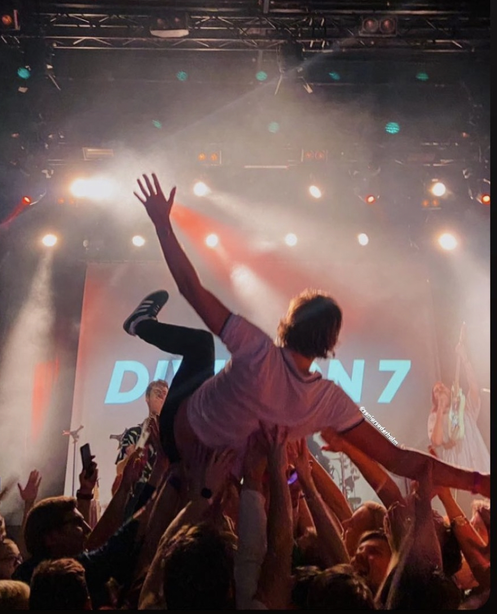

Sedan debutsingeln ”Inte hur du rör dig” släpptes 2017 har Division 7 blivit något som liknar ett fotbollslag med tillhörande supportrar. Fans reser över hela Sverige för att se spelningar med ”Divisionen”. Bandets spelningar har på bara några år gått från stökiga hemmafester till fulla, kokande konsertlokaler upp och ner längs E4:an. Vill du följa med? Kolla startsidan för kommande spelningar.

    

        
    

    

        
    

# Kommande spelningar

**2025-09-05** - Babel, Malmö [Biljetter](https://secure.tickster.com/sv/4djm32jd48bdb78/products)  
**2025-09-06** - Pustervik, Göteborg [Biljetter](https://secure.tickster.com/sv/l4chvck7v6ww3je/products)  
**2025-09-13** - Fållan, Stockholm – [Biljetter](https://secure.tickster.com/tvxxc2y1z85xjmr)  

# Tidigare spelningar

## 2024

**2024-11-16** - Katalin, Uppsala

**2024-11-09** - Dynamo, Norrköping

**2024-11-08** - Biljardkompaniet, Kristianstad

**2024-10-26** - Kulturens Hus, Luleå

**2024-10-25** - Väven, Umeå

**2024-10-24** - Jazzköket, Östersund

**2024-10-12** - Plan B, Malmö

**2024-10-11** - Tivoli, Helsingborg

**2024-10-10** - Kafé Deluxe, Växjö

**2024-10-05** - Pustervik, Göteborg

**2024-10-04** - Skylten, Linköping

**2024-09-14** - Nöjesfabriken, Karlstad  

**2024-09-13** - Live At Heart, Örebro  

**2024-09-13** - P4 Örebro, Live At Heart, Örebro  

**2024-08-30** - Folkets Hus, Vänersborg

**2024-08-24** - Herrljungafestivalen, Herrljunga

**2024-08-02** - Gott Snack Festival, Stockholm  

**2024-07-27** - Musikfesten i Tullakrok, Ängelholm  

**2024-07-26** - Strömsholmen (med Thomas Stenström), Eskilstuna  

**2024-06-07** – Under Bar Himmel, Örebro  

**2024-05-25** - Septembernatt 100 releaser, Stadgårdsterminalen, Stockholm

**2024-04-20** - Festivallen, Stångebrofältet, Linköping

**2024-04-19** - Debaser, Stockholm

**2024-04-13** - Slazk Studio, Stockholm

**2024-03-16** – Yaki-Da, Göteborg

**2024-01-16** – Live Sweden, Skellefteå

## 2023

**2023-10-14** – Plan B, Malmö

**2023-09-16** – Pustervik, Göteborg

**2023-08-05** – Gott Snack Festival, Stockholm

**2023-08-04** – Tovastugan, Nyköping

**2023-06-02** – Privatfest, Stockholm

**2023-05-19** – Bar Brooklyn, Stockholm

**2023-05-13** – Privatfest, Björnes, Örebro

**2023-04-27** – Kalmar Nation, Uppsala

**2023-04-15** – Blekingska nationen, Lund

**2023-02-04** – Skeppet, Göteborg

**2023-01-28** – Nalen Klubb, Stockholm

**2023-01-27** – Platens Bar, Linköping

## 2022

**2022-11-26** – Kafé Deluxe, Växjö

**2022-11-05** – Söderport, Kalmar

**2022-10-01** – Gott Snack live, Södra teatern, Stockholm

**2022-09-03** – Live at heart, Makeriet, Örebro

**2022-09-03** – Live at heart, Konserthuset foajén, Örebro

**2022-09-02** – Live at heart, Kvarteret, Örebro

**2022-08-20** – Privatfest, Stockholm

**2022-07-30** – Broken Dreams, Borlänge

**2022-07-01** – Tovastugan, Nyköping

**2022-06-10** – Oskars disputationsfest, Stockholm

**2022-06-04** – Svensexa, Spökparken, Stockholm

**2022-06-03** – Musikhuset, Gävle

**2022-05-27** – Scalakällaren, Stockholm

**2022-05-13** – Grand, Malmö

**2022-05-07** – Svampen, Örebro

**2022-05-06** – Platens Bar, Linköping

**2022-04-08** – Nefertiti, Göteborg

**2022-04-02** – Bomber Bar, Motala

## 2021

**2021-11-11** – Nomad, Stockholm

**2021-10-09** – Vega Bryggeri, Göteborg

**2021-10-02** – Babel, Malmö

**2021-09-18** – Vintervikens trädgårdscafé, Stockholm

**2021-09-04** – Live at heart, Makeriet magasinet, Örebro

**2021-09-04** – Live at heart, Makeriet, Örebro

**2021-09-03** – Live at heart, Konserthuset, Örebro

**2021-08-21** – Kulturparksfestivalen, Gula villan, Stockholm

**2021-07-09** – Tovastugan, Nyköping

**2021-07-08** – Fåfängan, Nyköping

**2021-06-17** – Nomad, Stockholm

**2021-06-16** – Nomad, Stockholm

**2021-06-15** – Musslan, Stockholm

## 2020

**2020-10-16** – Klubb John Doe, Skylten, Linköping

**2020-09-10** – Nomad, Stockholm

**2020-08-27** – Musslan, Stockholm

**2020-08-26** – Musslan, Stockholm

**2020-06-06** – Live Takeaway, Stockholm

**2020-02-22** – Jerntorgets Brygghus, Göteborg

## 2019

**2019-12-20** – Brother Tuck, Stockholm

**2019-10-30** – Snotty Seaside, Stockholm

**2019-06-13** – Scalakällaren, Stockholm

**2019-06-08** – Sliten popfest, Hisingen

**2019-05-25** – Emergenza (Stockholmsfinalen), Fryshuset, Stockholm

**2019-05-24** – Barn- och ungdomsfestivalen, Köping

**2019-05-03** – Oskars festlokal, Stockholm

**2019-05-03** – Emergenza (semifinal), Fryshuset, Stockholm

**2019-03-23** – Brother Tuck, Stockholm

## 2018

**2018-10-22** – Nalen Klubb, Stockholm

**2018-09-29** – Emergenza (kval), Stockholm

**2018-09-26** – Lilla Hotellbaren (Scandic Malmen), Stockholm

**2018-09-08** – Privatfest, Stockholm

**2018-08-24** – PSB, Stockholm

**2018-05-26** – Barn- och ungdomsfestivalen, Köping

**2018-05-26** – Stora Torget 3 Bistro & Bar, Köping

**2018-05-18** – Sommarfesten 2018, Södertörns Högskola, Stockholm

**2018-05-17** – PSB, Stockholm

**2018-05-13** – The Auld Dub, Stockholm

**2018-04-24** – Noel's, Stockholm

**2018-02-24** – Medusa Bar, Stockholm

## 2017

**2017-08-04** – PSB, Stockholm
